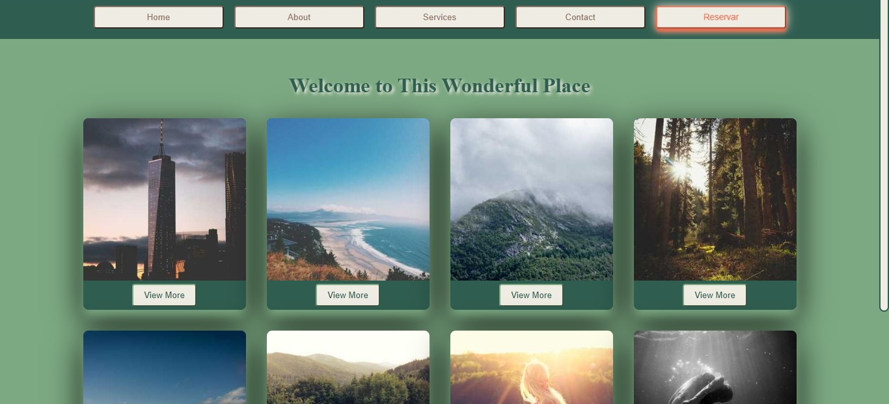
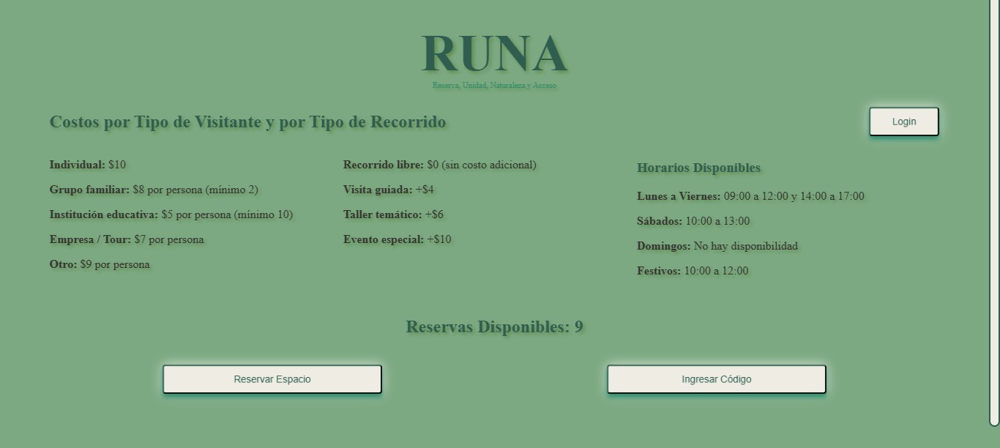
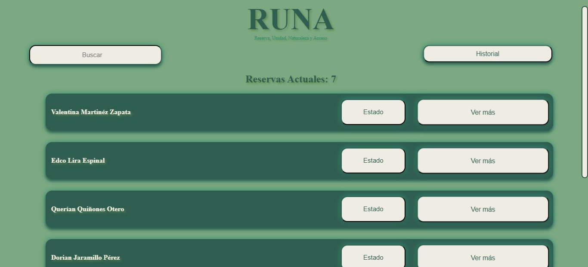
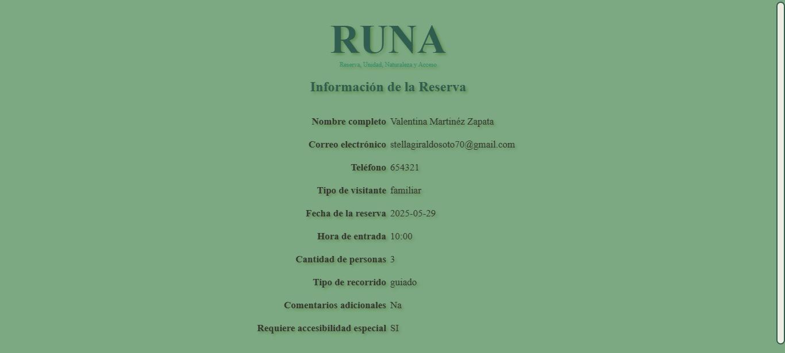
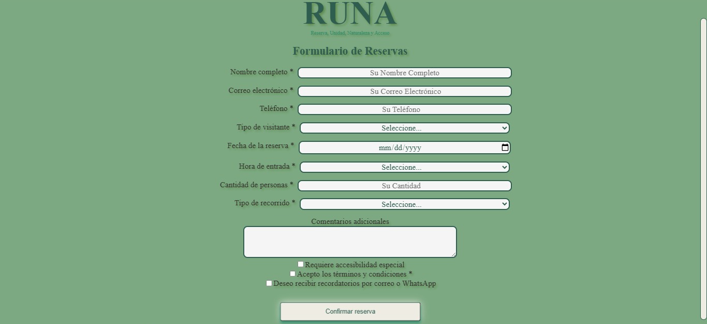
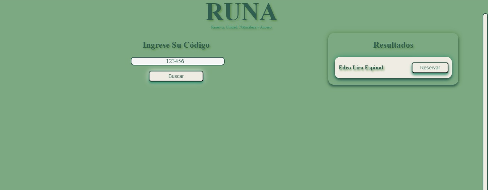

# 🌿 Natural Places Reservation System 

A digital reservation platform built to **enhance visitor experiences** and **optimize capacity management** in **natural parks, eco-reserves, and protected areas**. The system includes both a **user-friendly mobile/web interface** for reservations.
---

## 📱 User Portal Features

- Search and reserve spots in natural locations  
- Real-time availability and date filtering  
- Reservation confirmation and QR code check-in  
- Profile management and reservation history 

---

## 🛠️ Technologies Used

- **Node.js** / **Express**  (Backend)
- **MondoBD** (Database)
- **Angular** (Frontend)  

---

## 🌎 Why This Matters

Natural areas face increasing pressure from tourism. This system helps preserve nature while giving people **frictionless access** to the outdoors — creating a balance between **enjoyment** and **sustainability**.

---

## 📦 “Leave nothing but footprints, take nothing but memories.” – Anonymous

## Interface Images

